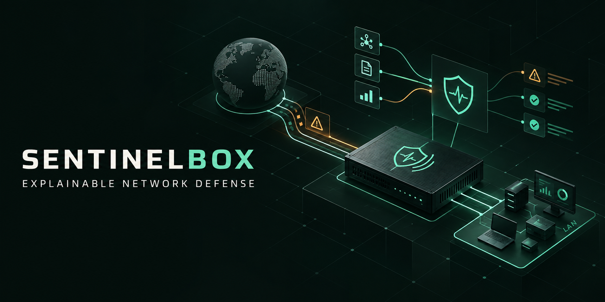
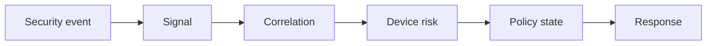

  

# SentinelBox

**Explainable network defense for small organizations.**

[Project website](https://sentinelbox.thebostromgroup.com) · UAT Student Innovation Project · Active prototype

SentinelBox is a local-first network-defense appliance designed for small organizations with roughly 5–100 endpoints. It observes network activity at the edge, correlates multiple security signals by device, calculates a persistent risk score, explains why that score changed, and applies only the reversible response allowed by policy.

The project is being developed by **Chance Butts** as a Student Innovation Project at the **University of Advancing Technology**.

> [!IMPORTANT]
> SentinelBox is an active academic prototype. It is not a production security product, an enterprise SIEM, an endpoint detection platform, a firewall replacement, or a guarantee against compromise.

## The problem

Small organizations may have firewall logs and intrusion alerts but lack the staff and tooling needed to connect weak signals over time. Individual alerts become noise, risky devices remain difficult to identify, and response decisions are often delayed or made without enough context.

SentinelBox explores a more focused question:

> Can a modest local appliance turn multiple network observations into an understandable device-risk decision and a safe, reversible response?

## Innovation

SentinelBox combines multiple Suricata events into a persistent risk score for each device. It preserves the supporting evidence, explains why the score changed, and applies only the reversible policy allowed for the resulting risk state.

The design emphasizes:

- Deterministic, device-centered risk scoring
- Multi-event correlation over time
- Visible evidence and plain-language explanations
- Risk decay when supporting evidence becomes stale
- Bounded policy states instead of arbitrary actions
- Reversible containment with administrator override
- Local processing without cloud dependence

## How it works

SentinelBox operates as a two-interface Debian gateway between the internet connection and the protected network.

1. **Detect** — Suricata observes network behavior and generates security events.
2. **Normalize** — Relevant observations become consistent, device-linked signals.
3. **Correlate** — Related signals are grouped across a defined time window.
4. **Score** — Deterministic weights and decay update the device risk score.
5. **Decide** — The score maps to a bounded policy state.
6. **Respond** — `nftables` applies the approved reversible control.
7. **Explain** — The dashboard shows the evidence, score change, policy, response, and override path.

## Policy states

| State | Meaning | Example response |
|---|---|---|
| `NORMAL` | Device behavior remains within the expected baseline | Continue normal observation |
| `WATCH` | Evidence warrants increased attention | Increase monitoring and retain context |
| `RESTRICTED` | Correlated evidence exceeds the restriction threshold | Limit selected network access |
| `CONTAINED` | Evidence reaches the highest configured risk boundary | Isolate device traffic pending review |

Policy thresholds and permitted responses are explicit. The decision engine cannot invent an action outside the configured state model.

## Technical architecture

| Layer | Technology | Responsibility |
|---|---|---|
| Operating platform | Debian Linux | Routed appliance and service host |
| Detection | Suricata | Local network-event detection |
| Decision engine | Go | Signal normalization, correlation, scoring, and policy evaluation |
| Operational state | SQLite | Device state, evidence, policy history, and audit records |
| Investigation | Gravwell Community Edition | Local event search and supporting investigation |
| Enforcement | `nftables` | Graduated and reversible network controls |
| Operator interface | Web dashboard | Device risk, explanations, health, and administrator actions |

The prototype targets repurposed small-form-factor hardware with two network interfaces. Its goal is a practical and testable edge appliance rather than production-scale enterprise coverage.

## Current prototype status

### Working foundation

- Routed WAN/LAN appliance path
- Strict configuration validation
- SQLite-backed state and audit persistence
- Service health monitoring
- Suricata-based detection foundation
- Restricted `nftables` enforcement foundation

### SIP implementation work

- Multi-event correlation by device and time window
- Persistent weighted risk with evidence decay
- `NORMAL`, `WATCH`, `RESTRICTED`, and `CONTAINED` policy states
- Administrator override and release workflow
- Operator dashboard and evidence views
- Controlled containment tests and performance measurements
- End-to-end demonstration from detection through recovery

## SIP roadmap

| Course | Focus | Planned outcome |
|---|---|---|
| SIP 311 | Define | Requirements, threat model, architecture, and test plan |
| SIP 312 | Build | Routed appliance, Suricata ingestion, inventory, and persistent events |
| SIP 401 | Decide | Correlation, risk decay, policy states, and administrator override |
| SIP 409 | Prove | Dashboard, containment tests, performance evidence, and showcase demonstration |

## Intended users

- **Small-business owners** who need an understandable answer to which device needs attention and why
- **IT generalists** who need focused evidence and safe controls instead of another stream of disconnected alerts
- **MSP technicians** supporting resource-constrained client networks that benefit from a consistent local triage view

## Project scope

SentinelBox is intentionally narrow. The prototype focuses on one small inline network and the explainable path from observation to response.

### In scope

- Network-event ingestion through Suricata
- Device-centered signal correlation
- Deterministic risk scoring and decay
- Evidence-backed explanations
- Bounded policy states
- Reversible `nftables` enforcement
- Local dashboard, investigation, and audit history
- Controlled functional and performance testing

### Outside the current MVP

- Cloud-hosted detection or management
- Endpoint agents or EDR functionality
- Artificial-intelligence-based decisions
- Enterprise SIEM replacement
- General-purpose firewall replacement
- Zeek integration
- VLAN lifecycle management
- Production certification or commercial deployment guarantees

## Design principles

1. **Explain before acting.** Every automated response should show the evidence and policy that produced it.
2. **Keep decisions bounded.** Scores map to explicit states with explicitly allowed actions.
3. **Prefer reversible controls.** An administrator must be able to review and release a device.
4. **Preserve evidence.** Risk decisions should remain traceable to their original observations.
5. **Stay local by default.** Detection, scoring, evidence, and enforcement remain on the appliance.
6. **Measure the prototype.** Claims should be supported by controlled tests and recorded results.

## Prior art

SentinelBox builds on established network-security patterns while exploring a distinct explainable decision layer.

| System | Established strength | SentinelBox research focus |
|---|---|---|
| [Firewalla](https://help.firewalla.com/hc/en-us/articles/360058853313-Firewalla-New-Device-Quarantine) | Network appliance and device controls | Ongoing multi-event risk for known and unknown devices, with visible reasoning and graduated states |
| [OPNsense IPS](https://docs.opnsense.org/manual/ips.html) | Suricata-based alerting and traffic blocking | Correlating multiple events before selecting a reversible device policy |
| [Security Onion](https://docs.securityonion.net/en/3/main/securityonion-docs.pdf) | Broad network monitoring and investigation | A focused risk-to-response engine for one small inline network |

## Repository maturity

This repository represents active prototype development. Interfaces, configuration formats, policy thresholds, and internal data structures may change as the SIP work progresses. Test results should be treated as version-specific evidence rather than general production claims.

## Responsible use

SentinelBox should be tested only on networks and devices you own or are explicitly authorized to administer. Automated containment can disrupt legitimate traffic, so enforcement features should remain fail-safe, observable, and reversible during prototype testing.

## Community and contributions

SentinelBox is being developed first as an academic prototype, but careful technical discussion and well-scoped contributions are welcome.

- Read [CONTRIBUTING.md](CONTRIBUTING.md) before proposing a change.
- Follow the project [Code of Conduct](CODE_OF_CONDUCT.md).
- Report suspected vulnerabilities according to [SECURITY.md](SECURITY.md), not through a public issue.
- Use the repository issue forms for reproducible defects and focused feature proposals.

Pull requests should preserve the project's core requirements: deterministic decisions, explainable evidence, bounded policy actions, reversible enforcement, local-first operation, and honest maturity claims.

## Author

**Chance Butts**  
Network Security student, University of Advancing Technology  
Founder and Senior Software Engineer, The Bostrom Group

Project site: [sentinelbox.thebostromgroup.com](https://sentinelbox.thebostromgroup.com)

---

SentinelBox is a Student Innovation Project and an active proof of concept. Project content may change as implementation and validation continue.
