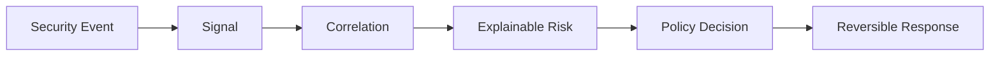

# SentinelBox Architecture

## Processing boundary



The long-running binary remains a modular Go monolith. Its current adapters are
TOML, SQLite, and HTTP. Milestone 2 adds a separate operator utility for the
routed-network installation boundary. Domain packages added later must remain
independent of those adapters.

## Current dependency flow

```text
cmd/sentinelbox
    -> internal/app
        -> internal/config
        -> internal/database/sqlite
            -> embedded migrations
        -> internal/api
        -> internal/logging

cmd/sentinelbox-network
    -> internal/config
    -> internal/network/topology
    -> internal/network/baseline
    -> internal/network/nftables
```

The entry point parses flags and operating-system signals. `internal/app` owns
dependency construction and lifecycle. The API depends on a small health
interface rather than the concrete SQLite type.

## State and data

SQLite operates in WAL mode with foreign keys enabled, synchronous mode NORMAL,
a bounded busy timeout, and no external database service. Migrations are
embedded and checksummed. Changed or unknown migrations prevent startup.

The initial migration contains foundation metadata only. Device, event, signal,
risk, policy, response, and audit tables will be introduced with the milestone
that owns each behavior rather than exposing unused partial features.

## Privilege boundary

The long-running control plane remains unprivileged. Milestone 2 stages
base-network configuration as an installation artifact and isolates live
nftables operations in a root-only operator utility. That utility owns exactly
`inet sentinelbox_filter` and `ip sentinelbox_nat`, never flushes the ruleset,
and checks and verifies changes. Dynamic nftables response, when implemented,
will cross a narrower local boundary that accepts only typed add, remove,
verify, and reconcile operations for SentinelBox-owned sets.

No generic shell executor belongs in the application dependency graph.

## Routed-mode limitation

The initial two-interface appliance can inspect and control traffic that crosses
it. Devices on the same downstream unmanaged switch and subnet can communicate
directly without sending frames through SentinelBox. Routed mode therefore
cannot guarantee blocking of same-subnet lateral SMB, RDP, SSH, or WinRM.

The MVP must describe containment as applying to gateway-routed paths. Complete
lateral containment requires segmentation, wireless client isolation, multiple
routed LAN zones, or another topology that forces endpoint-to-endpoint traffic
through SentinelBox.

## Safe startup posture

- HTTP listens on loopback only.
- The foundation example keeps network gateway configuration disabled; the
  routed example enables it only for the installation utility.
- Suricata ingestion is disabled.
- Automatic restriction and containment are disabled.
- WAN management is rejected by configuration validation.
- IPv6 forwarding is rejected until equivalent policy exists.

These constraints are intentionally relaxed only by the milestones that add and
verify the corresponding security controls.
